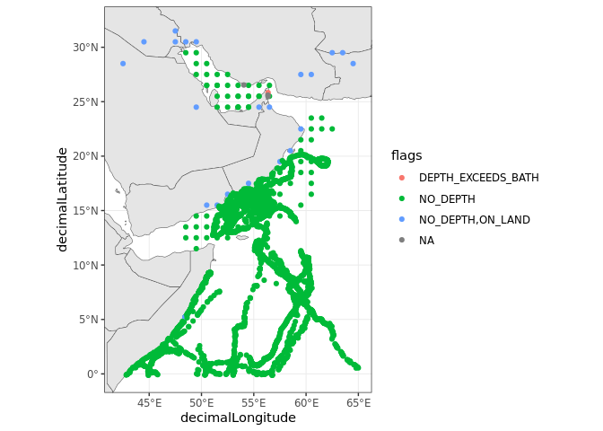

# Goal of the notebook

In this notebook, we will show how you can get some [Loggerhead sea
turtle (*Caretta
caretta*)](https://www.iucnredlist.org/species/3897/119333622) data from
2000 until present from the [Ocean Biodiversity Information System
(OBIS)](https://obis.org/). We will use the `robis` package to search
the OBIS library and download relevant data.

# Loading relevant libraries

``` r
#Dealing with spatial data
library(sf)
#Getting base maps
library(rnaturalearth)
#Access to OBIS
library(robis)
#Data manipulation and visualisation
library(tidyverse)
library(janitor)
```

# Creating a bounding box

We will use a bounding box for the region of our interest (Arabian Sea
and the Bay of Bengal) to extract *C. caretta* data relevant to our
study area.

``` r
#We create a bounding box using minimum and maximum coordinate pairs
extent_polygon <- st_bbox(c(xmin = 41.875, xmax = 65.125, 
                            ymax = -0.125, ymin = 32.125), 
                          #Assign reference system
                          crs = st_crs(4326)) %>% 
  #Turn into sf object
  st_as_sfc()

#Extract polygon geometry 
pol_geometry <- st_as_text(extent_polygon[[1]])
```

# Searching for sea turtle occurrence from OBIS

We will use the `robis` package to find observations of Loggerhead sea
turtles (*C. caretta*) published in OBIS.

``` r
#Search OBIS for loggerhead observations from 2000
caretta_obs <- occurrence("Caretta caretta", 
                          startdate = as.Date("2000-01-01"),
                          #Apply spatial constraint
                          geometry = pol_geometry,
                          #Include absence records if available
                          absence = "include")
```

    ## Retrieved 5000 records of approximately 5269 (94%)Retrieved 5269 records of
    ## approximately 5269 (100%)

``` r
#Check structure of results
glimpse(caretta_obs)
```

    ## Rows: 5,269
    ## Columns: 103
    ## $ associatedReferences          <chr> "[{\"crossref\":{\"citeinfo\":{\"origin\…
    ## $ basisOfRecord                 <chr> "MachineObservation", "MachineObservatio…
    ## $ bibliographicCitation         <chr> "[{\"crossref\":{\"citeinfo\":{\"origin\…
    ## $ catalogNumber                 <chr> "1014_8853", "1014_9766", "1014_8861", "…
    ## $ collectionCode                <chr> "1014", "1014", "1014", "1014", "1014", …
    ## $ coordinatePrecision           <chr> "9.99999999999999955e-07", "9.9999999999…
    ## $ coordinateUncertaintyInMeters <chr> "0.11", "0.11", "0.11", "0.11", "0.11", …
    ## $ datasetID                     <chr> "1014", "1014", "1014", "1014", "1014", …
    ## $ datasetName                   <chr> "IFREMER/Kélonia satellite tracked late …
    ## $ dateIdentified                <chr> "2012-03-30T08:55:10", "2011-04-12T19:12…
    ## $ decimalLatitude               <dbl> 9.14804, 6.40193, 9.21307, 15.39172, 15.…
    ## $ decimalLongitude              <dbl> 50.69448, 59.87883, 50.82211, 55.71303, …
    ## $ eventDate                     <chr> "2012-03-30T08:55:10", "2011-04-12T19:12…
    ## $ eventTime                     <chr> "05:55:10Z", "15:12:41Z", "23:43:31Z", "…
    ## $ family                        <chr> "Cheloniidae", "Cheloniidae", "Cheloniid…
    ## $ footprintWKT                  <chr> "POINT(50.69448 9.14804)", "POINT(59.878…
    ## $ genus                         <chr> "Caretta", "Caretta", "Caretta", "Carett…
    ## $ geodeticDatum                 <chr> "EPSG:4326 WGS84", "EPSG:4326 WGS84", "E…
    ## $ georeferencedDate             <chr> "2012-03-30T08:55:10", "2011-04-12T19:12…
    ## $ identificationRemarks         <chr> "Identification Type:Telemetry", "Identi…
    ## $ individualCount               <chr> "1", "1", "1", "1", "1", "1", "1", "1", …
    ## $ institutionCode               <chr> "IFREMER and Kélonia", "IFREMER and Kélo…
    ## $ kingdom                       <chr> "Animalia", "Animalia", "Animalia", "Ani…
    ## $ license                       <chr> "http://creativecommons.org/licenses/by-…
    ## $ lifeStage                     <chr> "Juvenile", "Juvenile", "Juvenile", "Juv…
    ## $ modified                      <chr> "2013-10-25 13:35:20", "2013-10-25 13:35…
    ## $ nomenclaturalCode             <chr> "WoRMS LSID", "WoRMS LSID", "WoRMS LSID"…
    ## $ occurrenceID                  <chr> "1014_8853", "1014_9766", "1014_8861", "…
    ## $ occurrenceRemarks             <chr> "Telemetry", "Telemetry", "Telemetry", "…
    ## $ occurrenceStatus              <chr> "present", "present", "present", "presen…
    ## $ order                         <chr> "Testudines", "Testudines", "Testudines"…
    ## $ organismID                    <chr> "57684", "66818", "57684", "66839", "668…
    ## $ organismRemarks               <chr> "Tagged animal. organismID may refer to …
    ## $ ownerInstitutionCode          <chr> "IFREMER and Kélonia", "IFREMER and Kélo…
    ## $ phylum                        <chr> "Chordata", "Chordata", "Chordata", "Cho…
    ## $ recordNumber                  <chr> "1014_8853", "1014_9766", "1014_8861", "…
    ## $ scientificName                <chr> "Caretta caretta", "Caretta caretta", "C…
    ## $ scientificNameAuthorship      <chr> "(Linnaeus, 1758)", "(Linnaeus, 1758)", …
    ## $ scientificNameID              <chr> "urn:lsid:marinespecies.org:taxname:1372…
    ## $ specificEpithet               <chr> "caretta", "caretta", "caretta", "carett…
    ## $ taxonRank                     <chr> "Species", "Species", "Species", "Specie…
    ## $ taxonRemarks                  <chr> "Taxon recorded as \"Caretta caretta\" b…
    ## $ taxonomicStatus               <chr> "valid", "valid", "valid", "valid", "val…
    ## $ type                          <chr> "Event", "Event", "Event", "Event", "Eve…
    ## $ verbatimEventDate             <chr> "2012-03-30 08:55:10", "2011-04-12 19:12…
    ## $ vernacularName                <chr> "Loggerhead Sea Turtle", "Loggerhead Sea…
    ## $ waterBody                     <chr> "Reunion Island,Oman,South-Africa", "Reu…
    ## $ id                            <chr> "000341f8-f206-4120-bc73-432a0c729d7a", …
    ## $ dataset_id                    <chr> "7687b242-05b7-48d7-a316-ba6dc34e72b5", …
    ## $ node_id                       <chr> "573654c1-4ce7-4ea2-b2f1-e4d42f8f9c31", …
    ## $ date_start                    <dbl> 1.333066e+12, 1.302566e+12, 1.333152e+12…
    ## $ date_mid                      <dbl> 1.333066e+12, 1.302566e+12, 1.333152e+12…
    ## $ date_end                      <dbl> 1.333066e+12, 1.302566e+12, 1.333152e+12…
    ## $ date_year                     <int> 2012, 2011, 2012, 2011, 2011, 2011, 2011…
    ## $ dropped                       <lgl> FALSE, FALSE, FALSE, FALSE, FALSE, FALSE…
    ## $ absence                       <lgl> FALSE, FALSE, FALSE, FALSE, FALSE, FALSE…
    ## $ marine                        <lgl> TRUE, TRUE, TRUE, TRUE, TRUE, TRUE, TRUE…
    ## $ subphylum                     <chr> "Vertebrata", "Vertebrata", "Vertebrata"…
    ## $ infraphylum                   <chr> "Gnathostomata", "Gnathostomata", "Gnath…
    ## $ megaclass                     <chr> "Tetrapoda", "Tetrapoda", "Tetrapoda", "…
    ## $ superclass                    <chr> "Reptilia", "Reptilia", "Reptilia", "Rep…
    ## $ suborder                      <chr> "Cryptodira", "Cryptodira", "Cryptodira"…
    ## $ superfamily                   <chr> "Chelonioidea", "Chelonioidea", "Cheloni…
    ## $ species                       <chr> "Caretta caretta", "Caretta caretta", "C…
    ## $ kingdomid                     <int> 2, 2, 2, 2, 2, 2, 2, 2, 2, 2, 2, 2, 2, 2…
    ## $ phylumid                      <int> 1821, 1821, 1821, 1821, 1821, 1821, 1821…
    ## $ subphylumid                   <int> 146419, 146419, 146419, 146419, 146419, …
    ## $ infraphylumid                 <int> 1828, 1828, 1828, 1828, 1828, 1828, 1828…
    ## $ megaclassid                   <int> 1831, 1831, 1831, 1831, 1831, 1831, 1831…
    ## $ superclassid                  <int> 1838, 1838, 1838, 1838, 1838, 1838, 1838…
    ## $ orderid                       <int> 2689, 2689, 2689, 2689, 2689, 2689, 2689…
    ## $ suborderid                    <int> 148741, 148741, 148741, 148741, 148741, …
    ## $ superfamilyid                 <int> 987094, 987094, 987094, 987094, 987094, …
    ## $ familyid                      <int> 136999, 136999, 136999, 136999, 136999, …
    ## $ genusid                       <int> 137066, 137066, 137066, 137066, 137066, …
    ## $ speciesid                     <int> 137205, 137205, 137205, 137205, 137205, …
    ## $ aphiaID                       <int> 137205, 137205, 137205, 137205, 137205, …
    ## $ originalScientificName        <chr> "Caretta caretta", "Caretta caretta", "C…
    ## $ category                      <chr> "VU", "VU", "VU", "VU", "VU", "VU", "VU"…
    ## $ flags                         <chr> "NO_DEPTH", "NO_DEPTH", "NO_DEPTH", "NO_…
    ## $ bathymetry                    <int> 35, 3051, 136, 2784, 2453, 2736, 2880, 2…
    ## $ shoredistance                 <int> 4680, 899682, 12208, 193567, 143853, 100…
    ## $ sst                           <dbl> 26.21, 28.67, 26.21, 27.00, 26.92, 26.92…
    ## $ sss                           <dbl> 35.63, 35.74, 35.65, 36.09, 36.09, 36.10…
    ## $ dynamicProperties             <chr> NA, NA, NA, NA, NA, NA, NA, NA, NA, NA, …
    ## $ sex                           <chr> NA, NA, NA, NA, NA, NA, NA, NA, NA, NA, …
    ## $ continent                     <chr> NA, NA, NA, NA, NA, NA, NA, NA, NA, NA, …
    ## $ country                       <chr> NA, NA, NA, NA, NA, NA, NA, NA, NA, NA, …
    ## $ day                           <chr> NA, NA, NA, NA, NA, NA, NA, NA, NA, NA, …
    ## $ georeferenceRemarks           <chr> NA, NA, NA, NA, NA, NA, NA, NA, NA, NA, …
    ## $ locality                      <chr> NA, NA, NA, NA, NA, NA, NA, NA, NA, NA, …
    ## $ maximumDepthInMeters          <dbl> NA, NA, NA, NA, NA, NA, NA, NA, NA, NA, …
    ## $ maximumElevationInMeters      <chr> NA, NA, NA, NA, NA, NA, NA, NA, NA, NA, …
    ## $ minimumDepthInMeters          <int> NA, NA, NA, NA, NA, NA, NA, NA, NA, NA, …
    ## $ minimumElevationInMeters      <chr> NA, NA, NA, NA, NA, NA, NA, NA, NA, NA, …
    ## $ month                         <chr> NA, NA, NA, NA, NA, NA, NA, NA, NA, NA, …
    ## $ recordedBy                    <chr> NA, NA, NA, NA, NA, NA, NA, NA, NA, NA, …
    ## $ references                    <chr> NA, NA, NA, NA, NA, NA, NA, NA, NA, NA, …
    ## $ samplingProtocol              <chr> NA, NA, NA, NA, NA, NA, NA, NA, NA, NA, …
    ## $ year                          <chr> NA, NA, NA, NA, NA, NA, NA, NA, NA, NA, …
    ## $ depth                         <dbl> NA, NA, NA, NA, NA, NA, NA, NA, NA, NA, …
    ## $ superdomain                   <chr> NA, NA, NA, NA, NA, NA, NA, NA, NA, NA, …
    ## $ superdomainid                 <int> NA, NA, NA, NA, NA, NA, NA, NA, NA, NA, …

## Exploring OBIS results

Our search produced 5269 results for the area of our interest. However,
before we continue to use this data as input for our species
distribution models, we must clean it first to ensure we have a good
quality dataset.

In this section, we will explore the results of our OBIS search so we
can design a data cleaning workflow. We will check the content of some
of the columns in our data frame.

You may want to refer to the [OBIS
manual](https://manual.obis.org/darwin_core.html) and the OBIS webpage
about [Data Access](https://obis.org/data/access/).

``` r
#Checking values in basis of record column
caretta_obs %>% 
  distinct(basisOfRecord)
```

    ## # A tibble: 2 × 1
    ##   basisOfRecord     
    ##   <chr>             
    ## 1 MachineObservation
    ## 2 Occurrence

In this context, `MachineObservation` refers to records obtained with
satellite tags. While `Occurrence` refers to records obtained by human
observers on the field. These two datasets cannot be treated in the same
way as `MachineObservation` records are not independent as they record
the movements of a single individual.

We can also check whether or not absence data is available for the
loggerhead se a turtles in our area of interest.

``` r
caretta_obs %>% 
  distinct(absence)
```

    ## # A tibble: 1 × 1
    ##   absence
    ##   <lgl>  
    ## 1 FALSE

We only have presence data available, which is an important factor to
consider when designing our species distribution model workflow.

We can also check the `coordinateUncertaintyInMeters`, which gives us an
indication of the error associated with a particular record. If we look
at the names of the columns printed at the beginning of the script, you
may notice that this column has been read as characters. We will change
it to numbers before looking at the values in the column.

``` r
#Changing column from characters to numeric
caretta_obs <- caretta_obs %>% 
  mutate(coordinateUncertaintyInMeters = as.numeric(coordinateUncertaintyInMeters))

#Checking uncertainty values for coordinates
caretta_obs %>% 
  distinct(coordinateUncertaintyInMeters)
```

    ## # A tibble: 3 × 1
    ##   coordinateUncertaintyInMeters
    ##                           <dbl>
    ## 1                          0.11
    ## 2                     111319.  
    ## 3                         NA

It is worth noting that not all providers share a measurement of
uncertainty, but we can use this whenever is available to apply some
sort of quality control to our data.

Here, we see that some observations have uncertainty of centimeters
(0.11 m), but there are other observations with uncertainty over 100 km.
For this example, we will remove these observations with large
uncertainties.

## Checking quality control flags

OBIS provides some quality control (QC) flags for each record that may
help us identify observations of lower quality. For an explanation of
OBIS flags, check [this repository](https://github.com/iobis/obis-qc).

First, we will check the quality flags included in our results.

``` r
caretta_obs %>% 
  distinct(flags)
```

    ## # A tibble: 4 × 1
    ##   flags             
    ##   <chr>             
    ## 1 NO_DEPTH          
    ## 2 NO_DEPTH,ON_LAND  
    ## 3 DEPTH_EXCEEDS_BATH
    ## 4 <NA>

We will now plot our dataset on a map and use the information in the
`flags` column to color code the observations. This can help us decide
whether we should include or exclude them from further analyses.

``` r
#Getting a world base map
world <- ne_countries(scale = "medium", returnclass = "sf")

#Starting a plot
ggplot()+
  #Adding base layer (world map)
  geom_sf(data = world)+
  #Adding sea turtle observations
  geom_point(data = caretta_obs, 
             #Using coordinates to plot and color based on value in flags column
             aes(decimalLongitude, decimalLatitude, color = flags))+
  #Constraining map to original bounding box
  lims(x = c(st_bbox(extent_polygon)$xmin, st_bbox(extent_polygon)$xmax),
       y = c(st_bbox(extent_polygon)$ymin, st_bbox(extent_polygon)$ymax))+
  #Applying theme without background
  theme_bw()
```



From the plot above, we should consider removing at least some of the
observations classified as `NO_DEPTH,ON_LAND`. This is because
loggerhead sea turtles are not present inland. Instead, they are found
in temperate and subtropical ocean waters and in sandy beaches.

Some of these observations appear to be quite close to the shore, so
they may have occurred in a sandy beach. We can check the proximity of
the observation to the shore using the `shoredistance` column, which
provides the distance to shore in meters.

``` r
caretta_obs %>% 
  filter(flags == "NO_DEPTH,ON_LAND") %>% 
  select(shoredistance) %>% 
  arrange(desc(shoredistance))
```

    ## # A tibble: 25 × 1
    ##    shoredistance
    ##            <int>
    ##  1          -231
    ##  2          -394
    ##  3          -971
    ##  4         -1403
    ##  5         -3895
    ##  6         -5896
    ##  7         -8319
    ##  8         -8562
    ##  9        -17661
    ## 10        -19763
    ## # … with 15 more rows

The inland observations are at least 231 meters away from the coast and
up to 515 kilometers. For simplicity, we will remove all points flagged
as `NO_DEPTH,ON_LAND`, but it is recommended that locations are looked
more in depth and determine how likely it was that an individual was
present at that location.

We can also check if any other observations have been reported in land.
We will filter out the `NO_DEPTH,ON_LAND` flags and check for any
negative values in the `shoredistance` column.

``` r
caretta_obs %>% 
  filter(flags != "NO_DEPTH,ON_LAND" & shoredistance < 0)
```

    ## # A tibble: 0 × 103
    ## # … with 103 variables: associatedReferences <chr>, basisOfRecord <chr>,
    ## #   bibliographicCitation <chr>, catalogNumber <chr>, collectionCode <chr>,
    ## #   coordinatePrecision <chr>, coordinateUncertaintyInMeters <dbl>,
    ## #   datasetID <chr>, datasetName <chr>, dateIdentified <chr>,
    ## #   decimalLatitude <dbl>, decimalLongitude <dbl>, eventDate <chr>,
    ## #   eventTime <chr>, family <chr>, footprintWKT <chr>, genus <chr>,
    ## #   geodeticDatum <chr>, georeferencedDate <chr>, …

No observations were returned, which is good news.

Another feature worth pointing out in our data is that some of the
observations appear to be gridded as they are evenly spaced. This is
confirmed by the `occurrenceRemarks` column, which states that some
observations are:
`Telemetry locations aggregated per species per 1-degree cell`. This is
not ideal and you may need to consider if the inclusion of these data
points are suitable for your project. In this example, we will remove
them from our analysis.

## Removing problematic observations

In this step, we will remove observations with coordinate uncertainty
over 100 km, any observations with the `NO_DEPTH,ON_LAND` flag, and any
records that have been aggregated to a 1-degree cell.

``` r
# caretta_obs %>% 
#   #Removing on land observations
#   filter(flags != "NO_DEPTH,ON_LAND" | is.na(flags)) %>% 
#   #        | coordinateUncertaintyInMeters > 100000) %>% 
#   # filter(!str_detect(occurrenceRemarks, "degree"))
```

## Keeping relevant columns

``` r
cols.to.use <- c("occurrenceID", "scientificName", "dateIdentified", "eventDate", "decimalLatitude", "decimalLongitude", "coordinateUncertaintyInMeters",
                 "individualCount","lifeStage", "sex",
                 "bathymetry",  "shoredistance", "sst", "sss")
df <- df[,cols.to.use]
write.csv(df, file="/home/jovyan/R/ohw23_proj_marinesdms/data/raw-bio/loggerhead-robis.csv", quote=FALSE)
```

``` r
ggplot(data = world) + geom_sf() +
  geom_sf(data = extent_polygon, color = "red", fill=NA)
```

Columns to get. Others? Gender?

``` r
# select columns
    colsWeNeed <- c("species", "lat", "lon", "locality", "year", 
        "coordinateUncertaintyInMeters", "occurrenceID", "occurrenceRemarks", 
        "geodeticDatum")
```

Get a data frame of loggerhead sea turtle data

``` r
spp <- "Caretta caretta"
loggerh <- dismo::gbif("Caretta", species = "caretta", 
        nrecs = 300, geo = TRUE, removeZeros = TRUE, ext = ext)
```

## To do

-   Get more sea turtle data
-   plot the data
-   find the turtles that are at sea and not on land
-   add a column for “on land” so we can analyze those separately
